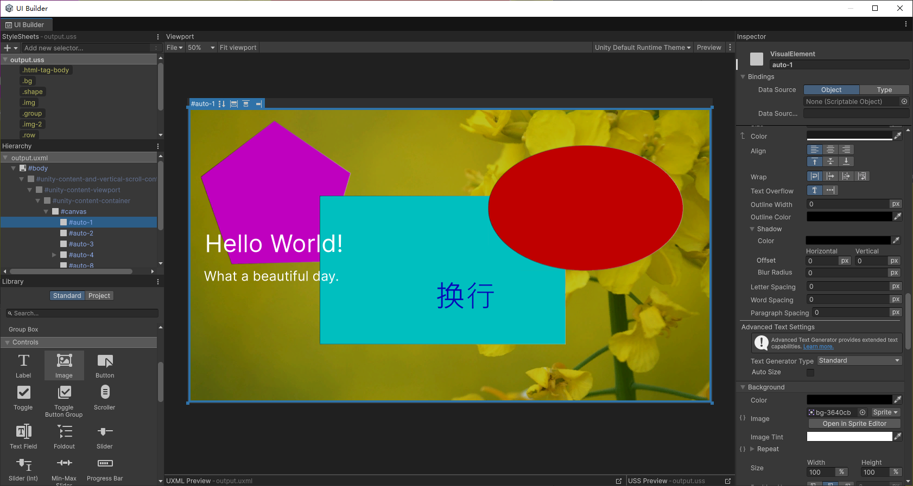
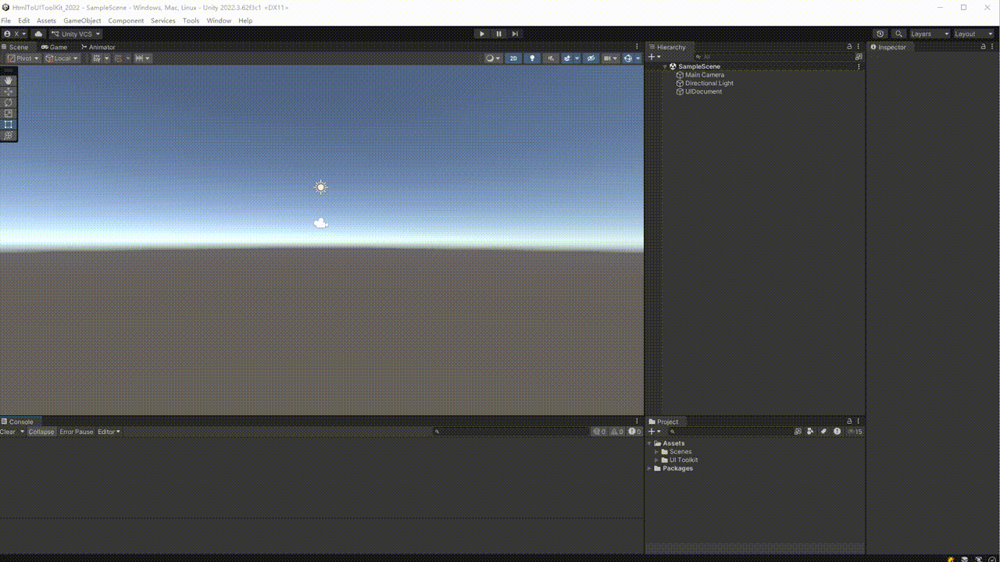
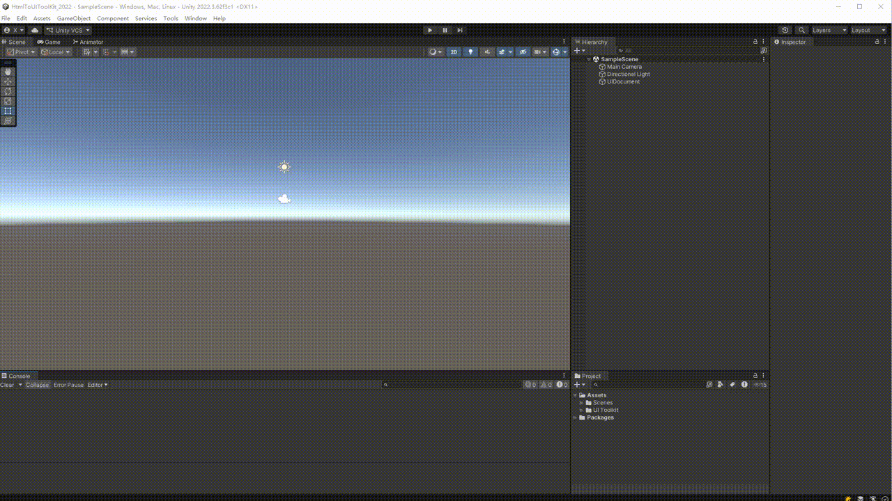

# 关于 HtmlToUIToolKit

[(English)](HtmlToUIToolKit_EN.md)

HtmlToUIToolKit 是一个 Unity 编辑器包，用于将 HTML/CSS 布局转换为 Unity UI Toolkit 的 UXML/USS 格式。它提供了浏览器的可视化转换工具，并内置 AI Prompt，可直接让 AI 生成 UXML/USS 代码。

适用场景：
- 使用 AI 生成 UI 布局，直接输出 UXML/USS
- 将设计师的 HTML 稿转换为 Unity UI
- 快速搭建编辑器工具和游戏 UI 原型



---

# 安装 HtmlToUIToolKit

## 通过 Git URL 安装

1. 打开 Unity **Package Manager**（Window > Package Manager）
2. 点击左上角 **+** → **"Add package from git URL..."**
3. 输入：
   ```
   https://github.com/jixinhaoqi/HtmlToUIToolKit.git
   ```
4. 点击 **Add** 完成安装

## 导入 Samples

1. 在 Package Manager 中找到 **HtmlToUIToolKit**
2. 展开 **Samples** 列表
3. 点击 **Example** 后的 **Import** 按钮
4. 示例文件位于 `Assets/Samples/HtmlToUIToolKit/0.1.0/Example/`


---

# 使用 HtmlToUIToolKit

## 工作流 A：AI 直接生成 UXML/USS（推荐）

这是最高效的方式，AI 直接输出可用的 UXML/USS 代码。

### 步骤

1. **准备 Prompt**：将 [`SKILL.md`](../Tools/HTMLTools/AI生成HTML提示词/SKILL.md) 的内容作为 AI 的系统提示词
2. **描述 UI**：用自然语言向 AI 描述你想要的界面布局
3. **获取代码**：AI 将返回标准的 UXML 和 USS 代码
4. **保存文件**：将代码分别保存为 `.uxml` 和 `.uss` 文件
5. **在 Unity 中使用**：通过 UI Builder 或 PanelSettings 引用这些文件


### 路径后处理（可选）

如果生成的 UXML/USS 中使用了图片资源，可以通过以下菜单进行路径转换：

- **Assets > HtmlToUIToolKit > uxml、uss转图集切片路径**
  - 将 `images/img/spriteName.png` 格式转为 `images/img.png#spriteName`（Sprite Atlas 引用）
- **Assets > HtmlToUIToolKit > uxml、uss转切片路径**
  - 将 `images/img.png#spriteName` 格式转回 `images/img/spriteName.png`（切片路径）

操作方式：在 Project 窗口中选中 `.uxml` 或 `.uss` 文件，右键选择对应菜单即可。处理逻辑见 [`HtmlToUIToolKitMenu.cs`](../Editor/HtmlToUIToolKitMenu.cs)。

> 注意：转换只会修改以 `project://` 开头的路径以外的所有图片引用。已在 Unity 中正确引用的资源不会被修改。

---

## 工作流 B：HTML 浏览器转换

适用于已有 HTML 设计稿、需要可视化预览后转换的场景。

### 步骤

1. **打开工具**：使用菜单 **Tools > HtmlToUIToolKit > 浏览器打开工具**，或直接打开 [`HTML转UIToolKit工具.html`](../Tools/HTMLTools/HTML转UIToolKit工具.html)
2. **粘贴 HTML**：将 HTML 源码粘贴到左侧面板
3. **设置分辨率**：在预览区上方设置目标分辨率（默认 1920x1080）
4. **预览效果**：中间面板实时显示 HTML 渲染效果
5. **执行转换**：点击 **"执行转换"** 按钮
6. **查看输出**：右侧面板显示 USS 和 UXML 代码，支持语法高亮
7. **导出文件**：使用 **下载 UXML** / **下载 USS** 按钮保存文件

  
  
  

详细操作参考 [`使用教程`](../Tools/HTMLTools/HTML转UIToolKit工具使用教程.md)。

---

# 技术详情

## 系统要求

此版本的 HtmlToUIToolKit 兼容以下 Unity 版本：

* Unity 2022.3 及以上（推荐）

浏览器转换工具需要支持 ES6 的现代浏览器（Chrome、Edge、Firefox 等）。

## HTML 标签映射参考

| HTML 标签 | UI Toolkit 元素 |
| --- | --- |
| `body`, `div`, `span`, `section`, `header`, `footer`, `nav`, `ul`, `ol`, `li`, `table`, `tr`, `td` | `ui:VisualElement` |
| `p`, `h1`-`h6`, `a`, `label`, `figcaption`, `pre`, `code`, `th`, `option` | `ui:Label` |
| `button`, `input[type=submit/button/reset]` | `ui:Button` |
| `img`, `svg`, `video` | `ui:Image` |
| `input[type=text/password/email/...]` | `ui:TextField` |
| `textarea` | `ui:TextField` (multiline) |
| `input[type=range]` | `ui:Slider` |
| `input[type=checkbox/radio]` | `ui:Toggle` |
| `input[type=number]` | `ui:IntegerField` |
| `select` | `ui:DropdownField` |
| `details` | `ui:Foldout` |
| `meter`, `progress` | `ui:ProgressBar` |

## CSS 属性映射参考

### 盒模型
`width`, `height`, `min-width`, `max-width`, `min-height`, `max-height`, `margin-*`, `padding-*`, `border-*-width`, `border-*-color`, `border-*-radius`

### Flexbox 布局
`flex-direction`, `flex-wrap`, `align-items`, `align-content`, `align-self`, `justify-content`, `flex-grow`, `flex-shrink`, `flex-basis`

### 视觉样式
`color`, `background-color`, `background-image` (url), `background-repeat`, `background-position`, `opacity`, `visibility`, `overflow`

### 定位
`position` (relative/absolute), `top`, `left`, `right`, `bottom`

### 文本样式
`font-size`, `font-weight` (→ `-unity-font-style`), `font-style` (→ `-unity-font-style`), `text-align` (→ `-unity-text-align`), `letter-spacing`, `word-spacing`, `white-space`, `text-overflow`, `text-shadow`

### Transform
`translate`, `scale`, `rotate` (展开为 USS 独立属性)

### 伪类
`:hover`, `:active`, `:inactive`, `:focus`, `:disabled`, `:enabled`, `:checked`, `:root`

## 已知限制

HtmlToUIToolKit 版本 0.1.0 包含以下已知限制：

* 不支持 `position: fixed` 和 `position: sticky` 定位
* 不支持 CSS Grid 的 `grid-template-columns` 和 `grid-template-rows`（Grid 容器会被转换为 Flexbox 近似布局）
* 不支持 `vh` / `vw` / `em` / `rem` 相对单位（需设置固定分辨率预览）
* `text-shadow` 仅支持单层阴影
* 浏览器转换工具依赖 DOM 引擎计算样式，与 Unity 运行时可能存在微小偏差
* 当前支持约 50 个 CSS 属性，部分复杂属性需手动补充 USS
* CSS `transition` 属性不会被转换（Unity UI Toolkit 使用不同的动画系统）

## 包内容

下表列出了包内的关键目录与文件：

| 路径 | 说明 |
| --- | --- |
| [`Editor/`](../Editor/) | Unity 编辑器脚本，包含 [`HtmlToUIToolKitMenu.cs`](../Editor/HtmlToUIToolKitMenu.cs) 路径后处理工具 |
| [`Tools/HTMLTools/`](../Tools/HTMLTools/) | 浏览器端转换工具与 AI Prompt |
| [`Tools/HTMLTools/HTML转UIToolKit工具.html`](../Tools/HTMLTools/HTML转UIToolKit工具.html) | 浏览器 HTML 转 UXML/USS 转换器 |
| [`Tools/HTMLTools/AI生成HTML提示词/SKILL.md`](../Tools/HTMLTools/AI生成HTML提示词/SKILL.md) | AI 生成 UXML/USS 的系统提示词 |
| [`Documentation/`](../Documentation/) | 使用文档 |
| [`Samples~/Example/`](../Samples~/Example/) | 示例场景（通过 Package Manager 导入） |

## 文档修订历史

| 日期 | 修订说明 |
| --- | --- |
| 2026-05-29 | 首次发布，对应版本 0.1.0。 |