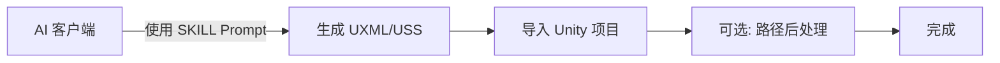
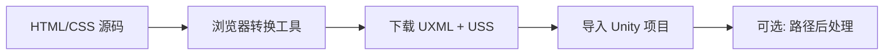

# Html To UIToolKit

[(English)](README_EN.md)

[](https://unity.com/)
[](LICENSE.md)


将 HTML/CSS 布局转换为 Unity UI Toolkit 的 [UXML/USS](Documentation/HtmlToUIToolKit.md) 格式。适用于：

 - AI 生成 UI 并直接输出 UXML/USS，无缝导入 Unity
 - 已有 HTML 设计稿，通过浏览器可视化工具实时预览并转换
 - 游戏 UI、编辑器工具界面的快速原型开发

---

## 核心工作流

本工具提供 **三种** 生成 UXML/USS 的方式，可根据场景灵活选择：

### 工作流 A：AI 直接生成 UXML/USS（推荐）



使用 [`SKILL.md`](Tools/HTMLTools/AI生成HTML提示词/SKILL.md) 作为 AI 的系统提示词，让 AI 直接输出符合 Unity 6 标准的 UXML/USS 内容。生成的代码可直接放入 `.uxml` 和 `.uss` 文件使用。


> 如需配合 Sprite Atlas 或切换图片引用方式，使用菜单 **Assets > HtmlToUIToolKit** 下的路径后处理功能。

### 工作流 B：HTML 浏览器转换



打开 [`HTML转UIToolKit工具.html`](Tools/HTMLTools/HTML转UIToolKit工具.html)（也可通过菜单 **Tools > HtmlToUIToolKit > 浏览器打开工具** 或 [在线运行工具](https://jixinhaoqi.github.io/HtmlToUIToolKit/)），粘贴 HTML 代码，实时预览效果后转换并下载。详细操作见 [`使用教程`](Tools/HTMLTools/HTML转UIToolKit工具使用教程.md)。

  

  

  

---

## 功能特性

- **HTML 标签智能映射** — 自动将 30+ HTML 元素映射为 UI Toolkit 控件（Label、Button、TextField、Slider、Toggle、ScrollView、Foldout 等）
- **CSS 样式转换** — 支持 50+ CSS 属性到 USS 的转换，包括盒模型、Flexbox、颜色、文本、Transform 等，自动展开简写属性
- **实时可视化预览** — 浏览器端 iframe 预览，所见即所得
- **内联元素自动分组** — `<span>`、`<b>`、`<i>` 等内联元素自动包裹为横向布局容器
- **富文本支持** — `<b>`/`<i>`/`<u>`/`<s>`/`<a>` 等标签转为 Unity 富文本标记
- **伪类支持** — `:hover`、`:active`、`:focus`、`:disabled` 等 8 种伪类
- **CSS Gradient 降级** — 渐变背景自动提取平均色转为纯色
- **Grid 布局模拟** — CSS Grid 自动转换为 Flexbox 近似布局
- **路径后处理** — Sprite Atlas 引用路径与切片路径双向转换
- **AI 友好** — 内置 SKILL Prompt，可直接让 AI 生成 UXML/USS

---

## 安装

### 通过 Git URL（推荐）

1. 打开 Unity 的 **Package Manager**（Window > Package Manager）
2. 点击左上角 **+** 按钮，选择 **"Add package from git URL..."**
3. 输入以下 URL：
   ```
   https://github.com/jixinhaoqi/HtmlToUIToolKit.git
   ```
4. 点击 **Add**，等待导入完成

### 导入 Samples

1. 在 Package Manager 中找到 **HtmlToUIToolKit**
2. 展开 **Samples** 列表
3. 点击 **Example** 后的 **Import** 按钮
4. 导入后可在 `Assets/Samples/HtmlToUIToolKit/` 下查看示例场景和转换源码


---

## 快速开始

### AI 直接生成（工作流 A）

1. 将 [`SKILL.md`](Tools/HTMLTools/AI生成HTML提示词/SKILL.md) 的内容作为 AI 的系统提示词
2. 用自然语言描述你想要的 UI 布局，让 AI 生成 UXML/USS
3. 将生成的代码保存为 `your_ui.uxml` 和 `your_ui.uss`
4. 在 Unity 中通过 UI Builder 或 PanelSettings 引用这些文件
5. 如使用了图片资源，右键 `.uxml`/`.uss` 文件，选择 **HtmlToUIToolKit** 菜单进行路径后处理

### 浏览器转换（工作流 B）

1. 使用菜单 **Tools > HtmlToUIToolKit > 浏览器打开工具** 或直接打开 [`HTML转UIToolKit工具.html`](Tools/HTMLTools/HTML转UIToolKit工具.html)
2. 参考 [`使用教程`](Tools/HTMLTools/HTML转UIToolKit工具使用教程.md) 完成转换

---

## HTML 标签映射参考

| HTML 标签 | UI Toolkit 元素 |
| --- | --- |
| `body`, `div`, `span`, `section`, `header`, `footer`, `nav`, `ul`, `ol`, `li`, `table`, `tr`, `td` | `ui:VisualElement` |
| `p`, `h1`-`h6`, `a`, `label`, `figcaption`, `pre`, `code`, `th`, `option` | `ui:Label` |
| `button`, `input[submit/button/reset]` | `ui:Button` |
| `img`, `svg`, `video` | `ui:Image` |
| `input[text/password/email/...]` | `ui:TextField` |
| `textarea` | `ui:TextField` (multiline) |
| `input[range]` | `ui:Slider` |
| `input[checkbox/radio]` | `ui:Toggle` |
| `input[number]` | `ui:IntegerField` |
| `select` | `ui:DropdownField` |
| `details` | `ui:Foldout` |
| `meter`, `progress` | `ui:ProgressBar` |

---

## 项目结构

| 路径 | 说明 |
| --- | --- |
| [`Editor/`](Editor/) | Unity 编辑器集成脚本与路径后处理 |
| [`Tools/HTMLTools/`](Tools/HTMLTools/) | 浏览器端转换工具与 SKILL Prompt |
| [`Documentation/`](Documentation/) | 使用文档（中文 & 英文） |
| [`Samples~/Example/`](Samples~/Example/) | 示例场景（通过 Package Manager 导入） |

---

## 三种方案对比

本工具与其他 UXML/USS 生成方案的详细对比，见 [`Compare_MCP_CLI.md`](Compare_MCP_CLI.md)。

---

## 已知限制

- 不支持 `position: fixed` / `position: sticky`
- 不支持 CSS Grid 的复杂模板（`grid-template-columns` / `grid-template-rows`）
- 不支持 `vh` / `vw` / `em` / `rem` 单位（需要设置固定分辨率预览）
- `text-shadow` 仅支持单层阴影
- 转换工具依赖浏览器 DOM 引擎计算样式，高保真还原需手动微调
- 当前仅支持 50+ CSS 属性，部分属性需通过 USS 手动添加