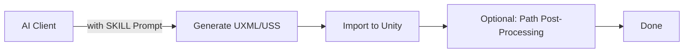
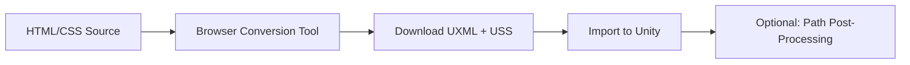

# HtmlToUIToolKit

[](https://unity.com/)
[](LICENSE.md)


Convert HTML/CSS layouts into Unity UI Toolkit [UXML/USS](Documentation/HtmlToUIToolKit_EN.md) format. Ideal for:

 - AI-generated UI that directly outputs UXML/USS for seamless Unity import
 - Converting existing HTML design drafts via a browser-based visual conversion tool
 - Rapid prototyping of game UI and editor tool interfaces

---

## Core Workflows

This toolkit provides **three** ways to generate UXML/USS:

### Workflow A: AI Direct Generation (Recommended)



Use [`SKILL.md`](Tools/HTMLTools/AI生成HTML提示词/SKILL.md) as the AI system prompt to generate Unity 6-compliant UXML/USS directly. The output can be saved as `.uxml` and `.uss` files for immediate use.

> For Sprite Atlas integration or path format switching, use **Assets > HtmlToUIToolKit** menu's path post-processing.

### Workflow B: HTML Browser Conversion



Open [`HTML转UIToolKit工具.html`](Tools/HTMLTools/HTML转UIToolKit工具.html) (or via menu **Tools > HtmlToUIToolKit > 浏览器打开HTML转UIToolKit工具** or [Online Tool](https://jixinhaoqi.github.io/HtmlToUIToolKit/)), paste HTML code, preview in real-time, convert and download. See [`Tutorial`](Tools/HTMLTools/HTML转UIToolKit工具使用教程_EN.md) for detailed steps.

---

## Features

- **Smart HTML Tag Mapping** — Auto-maps 30+ HTML elements to UI Toolkit controls (Label, Button, TextField, Slider, Toggle, ScrollView, Foldout, etc.)
- **CSS-to-USS Conversion** — Supports 50+ CSS properties, including box model, Flexbox, colors, text, Transform, with automatic shorthand expansion
- **Live Preview** — Browser-based iframe preview for WYSIWYG experience
- **Inline Element Grouping** — Auto-wraps `<span>`, `<b>`, `<i>` and other inline elements into horizontal layout containers
- **Rich Text Support** — `<b>`/`<i>`/`<u>`/`<s>`/`<a>` tags converted to Unity rich text markup
- **Pseudo-class Support** — 8 pseudo-classes including `:hover`, `:active`, `:focus`, `:disabled`
- **CSS Gradient Fallback** — Gradient backgrounds automatically reduced to an average solid color
- **Grid Layout Simulation** — CSS Grid automatically converted to Flexbox approximation
- **Path Post-Processing** — Bidirectional conversion between Sprite Atlas references and individual sprite paths
- **AI-Friendly** — Built-in SKILL Prompt for direct AI-generated UXML/USS

---

## Installation

### Via Git URL (Recommended)

1. Open Unity **Package Manager** (Window > Package Manager)
2. Click the **+** button, select **"Add package from git URL..."**
3. Enter:
   ```
   https://github.com/jixinhaoqi/HtmlToUIToolKit.git
   ```
4. Click **Add** and wait for import

### Import Samples

1. Find **HtmlToUIToolKit** in Package Manager
2. Expand the **Samples** list
3. Click **Import** next to **Example**
4. The sample scene and source files will be under `Assets/Samples/HtmlToUIToolKit/`

---

## Quick Start

### AI Direct Generation (Workflow A)

1. Use the content of [`SKILL.md`](Tools/HTMLTools/AI生成HTML提示词/SKILL.md) as the AI system prompt
2. Describe your desired UI layout in natural language and have the AI generate UXML/USS
3. Save the generated code as `your_ui.uxml` and `your_ui.uss`
4. Reference these files via UI Builder or PanelSettings in Unity
5. If using image assets, right-click `.uxml`/`.uss` files and use the **HtmlToUIToolKit** menu for path post-processing

### Browser Conversion (Workflow B)

1. Use menu **Tools > HtmlToUIToolKit > 浏览器打开HTML转UIToolKit工具** or open [`HTML转UIToolKit工具.html`](Tools/HTMLTools/HTML转UIToolKit工具.html) directly
2. Refer to the [`Tutorial`](Tools/HTMLTools/HTML转UIToolKit工具使用教程_EN.md) for conversion steps

---

## HTML Tag Mapping Reference

| HTML Tag | UI Toolkit Element |
| --- | --- |
| `body`, `div`, `span`, `section`, `header`, `footer`, `nav`, `ul`, `ol`, `li`, `table`, `tr`, `td` | `ui:VisualElement` |
| `p`, `h1`-`h6`, `a`, `label`, `figcaption`, `pre`, `code`, `th`, `option` | `ui:Label` |
| `button`, `input[submit/button/reset]` | `ui:Button` |
| `img`, `svg`, `video` | `ui:Image` |
| `input[text/password/email/...]` | `ui:TextField` |
| `textarea` | `ui:TextField` (multiline) |
| `input[range]` | `ui:Slider` |
| `input[checkbox/radio]` | `ui:Toggle` |
| `input[number]` | `ui:IntegerField` |
| `select` | `ui:DropdownField` |
| `details` | `ui:Foldout` |
| `meter`, `progress` | `ui:ProgressBar` |

---

## Project Structure

| Path | Description |
| --- | --- |
| [`Editor/`](Editor/) | Unity editor integration scripts and path post-processing |
| [`Tools/HTMLTools/`](Tools/HTMLTools/) | Browser conversion tool and SKILL Prompt |
| [`Documentation/`](Documentation/) | User documentation (CN & EN) |
| [`Samples~/Example/`](Samples~/Example/) | Example scene (import via Package Manager) |

---

## Comparison of Approaches

For a detailed comparison of this toolkit with other UXML/USS generation approaches, see [`Compare_MCP_CLI_EN.md`](Compare_MCP_CLI_EN.md).

---

## Known Limitations

- `position: fixed` / `position: sticky` not supported
- CSS Grid complex templates (`grid-template-columns` / `grid-template-rows`) not supported
- `vh` / `vw` / `em` / `rem` units not supported (requires fixed-resolution preview)
- `text-shadow` only supports single-layer shadows
- The conversion tool relies on the browser DOM engine for style computation; high-fidelity results may require manual tweaking
- Currently supports 50+ CSS properties; some properties need manual USS additions

---

## License

This project is open-sourced under the [MIT License](LICENSE.md).

---

## Contact

- GitHub: [jixinhaoqi](https://github.com/jixinhaoqi)
- Email: 1515885925@qq.com